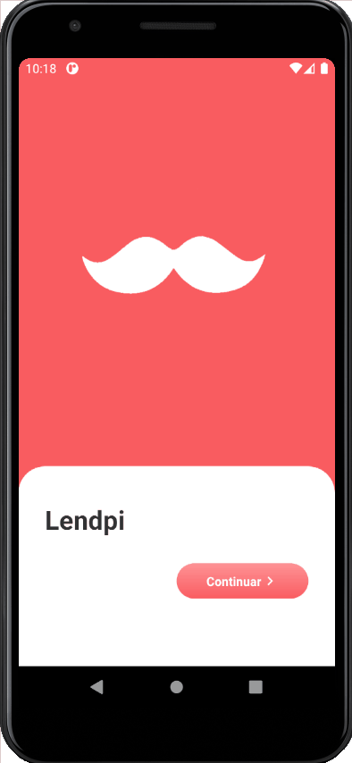

# Rappi App


- App

# Development Environment Configuration

- Create a new folder called “Lendpi”.

- Inside the folder create a new react-native project called **app**:

    ```bash
  npx react-native init app
  ```

- Download the files from this repository.

    ```bash
  git clone https://github.com/Virteip/Lendpi.git
  ```

- Enter the cloned project's folder.

  ```bash
  cd Lendpi
  ```

- Switch to the 'develop' branch.

  ```bash
  git checkout develop
  ```

- Delete the following files from the new project you just created root folder: **App.js** and **index.js**.

- Copy the following files from the cloned **Lendpi**/investor or **Lendpi**/worker folder to the root of the new project you created.
  - assets/
  - components/
  - model/
  - screens/
  - App.js
  - index.js

- Go to the file `android/app/build.gradle` and add the following line at the end of the file:

    ```
    apply from: "../../node_modules/react-native-vector-icons/fonts.gradle"
    ```

- Download and install the following modules from the project's root folder:
  - yarn add @react-navigation/native
  - yarn add react-native-reanimated react-native-gesture-handler react-native-screens react-native-safe-area-context @react-native-community/masked-view
  - yarn add react-native-paper
  - yarn add react-native-vector-icons
  - yarn add @react-navigation/stack
  - npm install react-native-animatable --save
  - npm install react-native-linear-gradient --save
  - yarn add @react-navigation/drawer
  - yarn add @react-navigation/material-bottom-tabs
  - npm install react-hook-form
  - yarn add @react-native-community/async-storage
  - yarn add @react-native-community/google-signin
  - yarn add @react-native-community/toolbar-android
  
- Execute the app
  
  - npx react-native run-android


